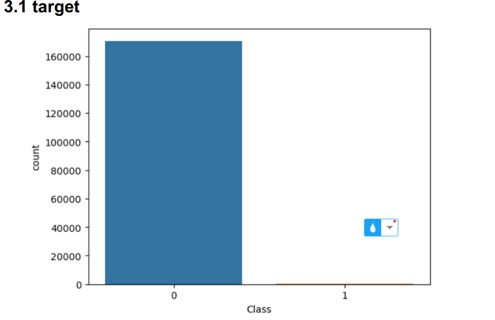
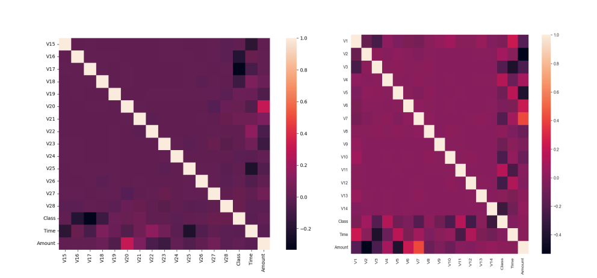

# Credit Card Fraud Detection

  

## Problem Definition

Credit card fraud detection is a major concern for financial institutions worldwide, as fraudulent transactions can cause significant financial losses and damage customer trust. The goal of this project is to develop a machine learning model that can accurately distinguish between legitimate and fraudulent credit card transactions. Given the highly imbalanced nature of the dataset, this project prioritizes techniques that effectively identify rare fraudulent transactions without compromising the accuracy of detecting legitimate transactions.

## Dataset

This project uses the Credit Card Fraud Detection Dataset, a labeled dataset commonly used to train and evaluate machine learning models for detecting fraudulent credit card transactions. Each transaction is represented as a data point with several anonymized features, enabling detailed analysis and model training without revealing sensitive customer information.

**Dataset Composition**
- **Time**: Seconds elapsed between the first transaction in the dataset and the current transaction.
- **V1 to V28 (Anonymized Features)**: Result of Principal Component Analysis (PCA) transformation to protect user privacy. Capture transaction patterns, behavior, and anomalies.
- **Amount**: Monetary value of the transaction. Useful for predicting fraud based on amount ranges or patterns.
- **Class (Target Variable)**: Binary indicator (fraudulent `1`, legitimate `0`). Highly imbalanced, with the majority of transactions being legitimate.

## Data Analysis

- **Target**: The dataset is heavily imbalanced; class `0` (legitimate) is the majority, and class `1` (fraudulent) is the minority.

  

- **Correlation**: Analysis was performed to explore correlations between features and the target variable.

  

## Data Preprocessing

- **Data Scaling**: Standardized features using `StandardScaler` to ensure mean zero and unit variance, improving model convergence.
- **Data Resampling**: Addressed class imbalance using:
  - **Random Undersampling**: Reduced non-fraudulent transactions for a balanced dataset.
  - **SMOTE Oversampling**: Synthesized fraudulent samples to enhance detection.
  - **Combined Approach**: Used both undersampling and SMOTE for optimal balance.

## Models

Several machine learning models were trained and evaluated to determine the best-performing model for fraud detection, focusing on handling imbalanced data and achieving high F1 scores.

### Models Used

1. **Logistic Regression**
   - Linear, efficient baseline; works well with imbalanced datasets.
2. **Random Forest Classifier**
   - Ensemble of decision trees; robust to overfitting and captures complex interactions.
3. **MLP (Multi-Layer Perceptron) Classifier**
   - Neural network for high-dimensional problems; requires careful tuning to avoid overfitting.
4. **Voting Classifier**
   - Combines predictions from multiple models using majority voting for improved performance.
5. **XGBoost**
   - Gradient boosting algorithm; effective for structured data and imbalanced problems.

### Hyperparameter Tuning

Performed using `RandomizedSearchCV` for efficiency, optimizing each model’s parameters:

- **Logistic Regression**: `C`, `max_iter`, `solver`, `penalty`, `l1_ratio`, `class_weight`
- **Random Forest**: `n_estimators`, `max_depth`, `min_samples_split`, `min_samples_leaf`, `class_weight`
- **MLP Classifier**: `hidden_layer_sizes`, `activation`, `alpha`, `solver`, `max_iter`
- **XGBoost**: `subsample`, `n_estimators`, `max_depth`, `learning_rate`, `colsample_bytree`
- **Voting Classifier**: Ensemble weights

#### Best Hyperparameters Summary

- **Random Forest**:  
  - `n_estimators`: 100  
  - `min_samples_split`: 2  
  - `min_samples_leaf`: 1  
  - `class_weight`: {0: 1, 1: 0.1}

- **MLP Classifier**:  
  - `solver`: 'adam'  
  - `max_iter`: 150  
  - `hidden_layer_sizes`: (150,)  
  - `alpha`: 0.0001  
  - `activation`: 'relu'

- **Logistic Regression**:  
  - `solver`: 'saga'  
  - `penalty`: 'elasticnet'  
  - `l1_ratio`: 0.9  
  - `class_weight`: {0: 1, 1: 0.2}  
  - `C`: 10

- **XGBoost**:  
  - `subsample`: 0.9  
  - `n_estimators`: 150  
  - `max_depth`: 6  
  - `learning_rate`: 0.2  
  - `colsample_bytree`: 0.9

- **Voting Classifier**:  
  - `weights`: [1, 3, 1]

## Evaluation

Performance metrics focus on F1 Score and the Precision-Recall Area Under the Curve (PR AUC), using both training and validation datasets.

| Model                | Training F1 | Training PR AUC | Validation F1 | Validation PR AUC |
|----------------------|-------------|-----------------|---------------|-------------------|
| Random Forest        | 0.9637      | 0.9665          | 0.8743        | 0.8797            |
| MLP Classifier       | 0.9885      | 0.9890          | 0.8276        | 0.8287            |
| Logistic Regression  | 0.8723      | 0.8901          | 0.7929        | 0.7965            |
| Voting Classifier    | 0.9578      | 0.9613          | 0.8757        | 0.8796            |
| XGBoost              |     —       |      —           | 0.8554        | 0.8617            |

- **Notes**: Random Forest and Voting Classifier demonstrate strong performance, though Random Forest shows some overfitting. MLP excels in training but generalizes poorly. Logistic Regression generalizes better.

## Best Model and Testing

- The **Voting Classifier** proved to be the best performing model.
- **Testing Results**:
  - F1 Score: **0.8528**
  - PR AUC: **0.8531**

## Conclusion

This project presents a robust approach to credit card fraud detection using a combination of data preprocessing techniques and advanced machine learning models, with thorough hyperparameter tuning and evaluation. The Voting Classifier, leveraging the strengths of multiple models, achieved the best balance between precision and recall for identifying fraudulent transactions.

---

> **Author:** Mohamed Ehab  
> **Repository:** [Credit-Card-Fraud-Detection-](https://github.com/mohamed-ehab415/Credit-Card-Fraud-Detection-)
